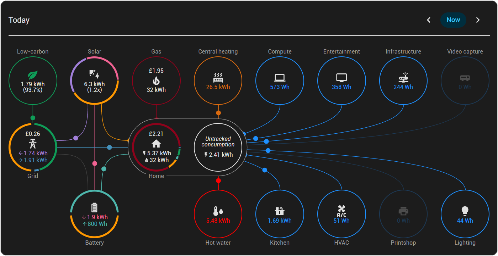
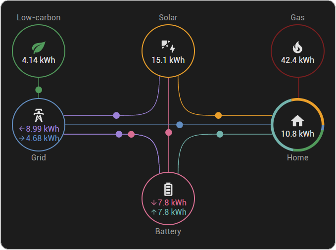
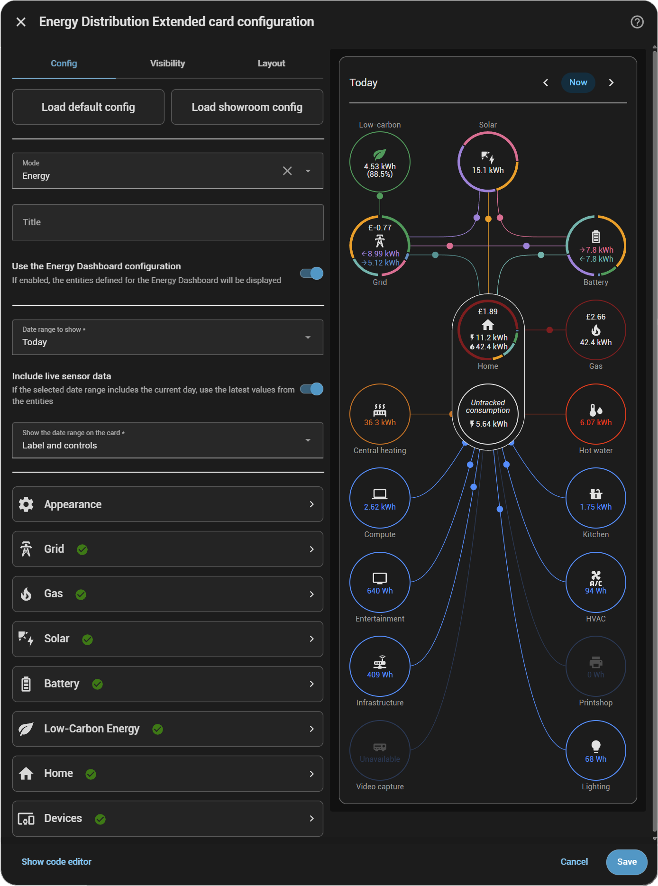

# Energy Distribution Extended


[](https://github.com/hacs/integration)


### An upgraded and configurable Energy Distribution Card, with a raft of new features and improvements. It supports both Energy and Power flows, additional Devices and live sensor-data display.



---

## Contents

### [What's new](#features)

### [Installation](#installation)

### [Getting started](#getting-started)

### [User guide](docs/guide/user-guide.md)

### [Reference manual](docs/reference/config.md)

---

### Features

- Optional automatic loading of the config from the [Energy Dashboard](https://www.home-assistant.io/docs/energy/) for hassle-free out-of-the-box setup
- Configure entities independently of the Energy Dashboard
- Add any number of entities for each circle
- Display either Energy flows or Power flows
- Add Devices - entities which either consume energy/power within the home, supply energy/power to it or both - so you can see where in your home energy/power is being used
- Show secondary data from other entities
- Click on the state-values to display the entity's details
- Connect to an Energy Date Picker card and refresh as the selected date-range changes, or select a fixed date-range
- Show the latest values from the entities, rather than just the current statistics from the database
- Use hourly statistics to calculate the flows more accurately
- Show energy in watt-hours, joules or calories
- Show the ratio of energy/power generated from solar to energy/power consumed by the home 
- Show gas as volume instead of energy
- Show gas usage in the Home circle
- Show power-outages on the grid

### Customisation

- Rename the circles
- Change the icons
- Change the colours
- Dim or grey-out inactive flow-lines
- Disable flow-line animation
- Show low-carbon as an energy/power value, a percentage or both
- Add a title to the card
- Add a link to a HASS dashboard
- Hide zero-values
- Set your own unit-prefixes and decimal places for values
- Choose where or if to show the units for values

### Graphical improvements

- Circles can show where the energy/power they produce was sent, and where the energy/power they received came from
- The flow-line dots stay the same size as the card is resized
- Circles resize to fit their content
- Optional gaps between segments in circles to improve clarity

---

## Installation
### HACS (recommended)
This card is available in [HACS](https://hacs.xyz/) (Home Assistant Community Store).

_HACS is a third party community store and is not included in Home Assistant out of the box. To install it, please follow their instructions [here](https://www.hacs.xyz/docs/use/)._

To install:

- Go to [HACS](http://home-assistant.local:8123/hacs/dashboard) in your Home Assistant
- Search for `Energy Distribution Extended`
- Install via the UI

<details>

<summary>Manual Install</summary>

1. Download and copy `energy-distribution-ext.js` from the [latest release](https://github.com/alex-taylor/energy-distribution-ext/releases/latest) into your `config/www` directory.

2. Add the resource reference as described below.

### Add resource reference

If you configure dashboards via YAML, add a reference to `energy-distribution-ext.js` inside your `configuration.yaml`:

```yaml
resources:
  - url: /local/energy-distribution-ext.js
    type: module
```

If you use the graphical editor, add the resource:

1. Advanced mode must be enabled in [your user profile](http://home-assistant.local/profile)
2. Navigate to Settings → Dashboards
3. Click three dot icon
4. Select [Resources](http://home-assistant.local/config/lovelace/resources)
5. Click the (+ Add Resource) button
6. Enter URL `/local/energy-distribution-ext.js` and select type `JavaScript Module`

</details>

---

## Getting started

### A newly-created Energy Distribution Extended card will have a similar appearance and behaviour to the official HASS card:


### If that is all you need then no additional configuration is needed!  But it offers many more options for customisation...


### The best way to figure out what you want the card to do for you is to have a play around with the settings, but it's also worth having a quick look at the [User Guide](docs/guide/user-guide.md) for hints and tips on how to get the most out of it!

> Clicking on 'Load default config' will reset the card to its out-of-the-box settings. Clicking on 'Load showroom config' will enable most of the new functionality.
> > Both of these buttons will replace any existing configuration.

### Everything can be configured using the UI, but if you feel more at home in YAML, see the [Reference Manual](docs/reference/config.md) for full details.
