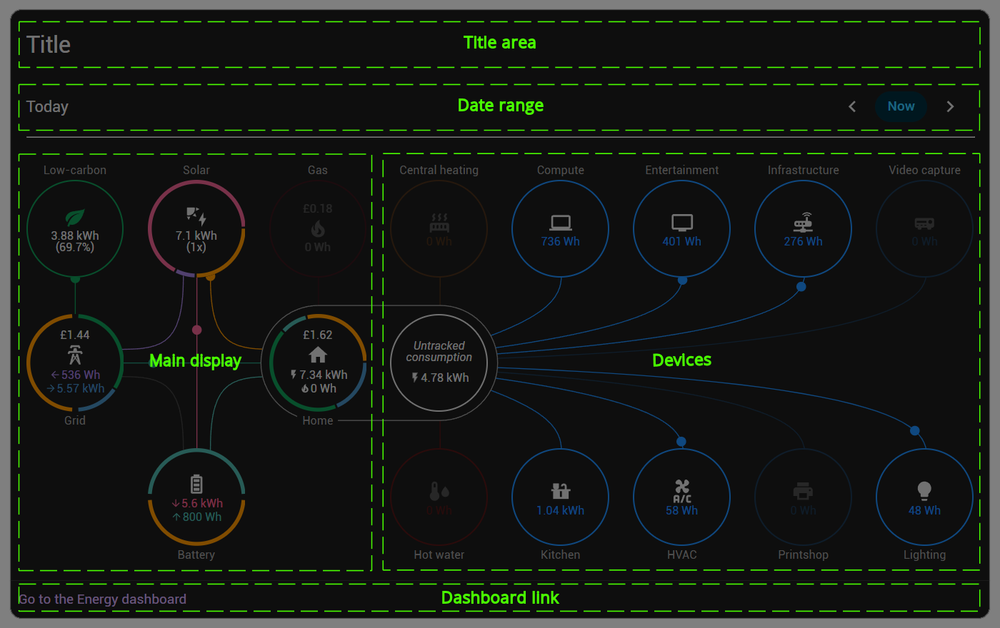
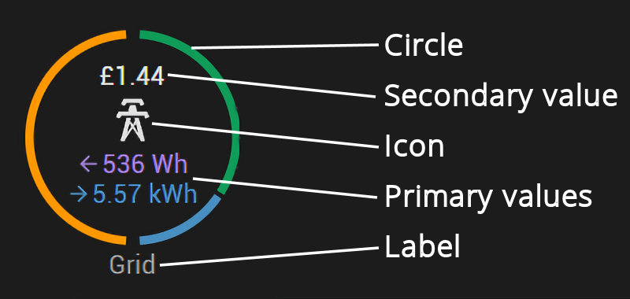
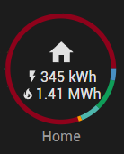
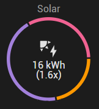
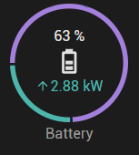
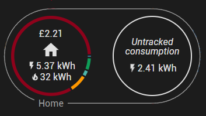
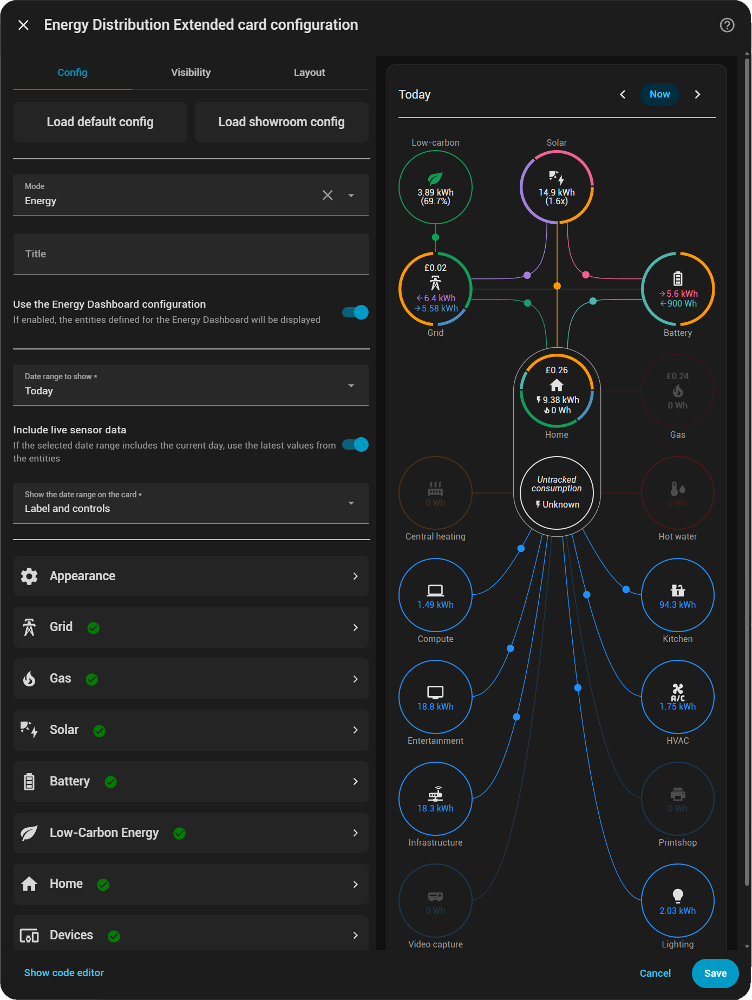
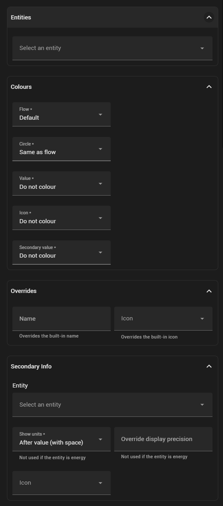
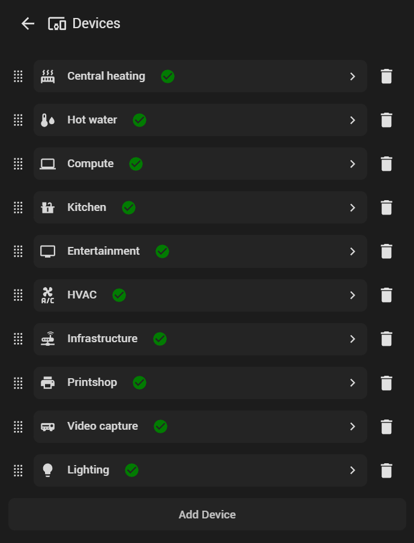
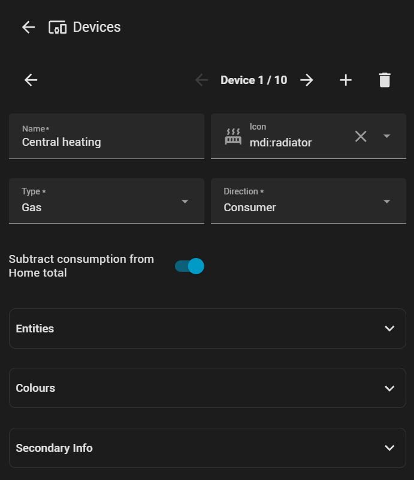

# User Guide

This is a brief guide to the functionality of the card.  The best way to learn what it can do for you is to play around with the settings yourself - what follows here is to highlight some functionality and explain some behaviour which may seen non-obvious at first!

## Contents

### [The Card](#the-card)

### [Configuration](#configuration)

---

# The Card

The card is divided into a number of areas:

Most of these are optional - the only one shown at all times is the 'Main display', which holds your primary energy/power sources and storage and of course your home.  The others are shown as needed by your configuration.

---

## Nodes

Each node in your system is represented by a circle on the card - 'Solar', 'Grid', 'Home' and so on - and is joined to one or more other nodes by flow-lines representing the ways in which energy/power is distributed throughout your setup.

The appearance and behaviour of the nodes is highly configurable; different nodes support slightly different options but they all have things in common:

You can change the node's label; its icon; the way in which the circle is rendered; the colours; and what secondary data is displayed.

The circle may be a single colour or - as shown in the example - segmented, where the segments represent different proportions of energy/power.  This behaviour can be enabled for each of the 'Solar', 'Grid', 'Battery' and 'Home' nodes independently, and has slightly different meanings in each:

- In Solar, the segments represent where the generated energy/power is going: to the Home (yellow); to the Battery (pink); or to the Grid (purple)
- In Grid
  - If in 'Energy' mode and both import and export are configured the circle is divided into two:
    - the half that faces the centre of the Main display represents energy imported from the grid, and the segments denote its destination - Battery in purple and Home in blue (and green if low-carbon energy is present)
    - the other half represents tne energy being exported to the grid, and the segments show where it originated: Battery in cyan and Solar in yellow
  - If only import or export is configured, or if the card is in 'Power' mode, the entire circle is used to display the segments
- In Battery, the half of the circle facing the centre of the Main display represents discharge and the other half represents charge; as with the other nodes, the colours indicate the destination/origin respectivel
- In Home the segments represent the origin of the energy/power being used

> Note that the relative sizes of the segments in a circle - or half-circle - should not be compared to the sizes of the segments in other circles.  They represent a proportion of the total value displayed in this circle only.

Some nodes display only a single primary value - for example, 'Gas' - and others, like the one shown, display two.

> All values are numeric: the card does not support displaying non-numeric entities such as text or dates.  If a value cannot be read from the entity, 'Unavailable' is shown instead.  In 'Energy' mode, if the value is negative - something which is by definition impossible - 'Unknown' is displayed.  In 'Power mode' if the node isn't doing anything, 'Idle' is displayed rather than zero.

Primary values are read from the main entities defined for the node: all nodes support multiple primary entities, and their values are summed for display.  Secondary values support only a single entity.

> In 'Energy' mode, entities - both primary and secondary - must have a StateClass of either 'Total' or 'Total_Increasing'.  Primary entities must have a DeviceClass of 'Energy'.
> 
> In 'Power' mode entities must have a StateClass of 'Measurement'.  Primary entities must have a DeviceClass of 'Power'.
> 
> These are intentional limitations, particularly in the case of 'Energy' mode, as in this mode the card is displaying state over a period of time and a non-time-based entity such as a 'Measurement' would have no meaning.

Node-specific behaviour is detailed in the next secion.

---

## Home

The Home node displays the total amount of energy/power in your home.  By default, it displays only the electric total, but you may configure it to show the gas total as well:

Gas can be added to the total value shown or, as above, displayed separately.  In both cases the gas usage is added to the segments of the circle.

---

## Solar

The Solar node can be configured to show the ratio of solar energy/power generated to electricity consumed by your home:

---

## Battery

In 'Power' mode if the secondary entity configured for the Battery node is a state-of-charge entity, its value will be used to control the default icon for the node:

---

## Devices

In addition to the built-in set of nodes (Solar, Battery, Grid, Home, Gas, Low-carbon) you may define your own 'Device' nodes.  Each of these represents something connected to your home which consumes or produces energy.  A Device may be either electric or gas, and may consume, produce or do both.  Any number of devices may be configured, subject to your having enough screen-area to display them all! 

Each Device may be configured to have its consumption subtracted from the Home node's total: this will cause the Home node to look like this:

The left-hand side displays the totals for the Home as before; the right-hand side displays any remaining 'untracked' energy/power after subtracting the consuming Devices.

---

# Configuration

The most important options are on the main page:

If 'Energy' mode is selected you can choose whether the date-range to show is taken from the HASS Energy Dashboard Date Selector card or is set to a pre-defined value: 'Today', 'This Week', 'This Month' and so on.

By default the card will only show values from HASS statistics - the same behaviour as the HASS Energy Dashboard - but by enabling live sensor data you can see the up-to-date values of the sensors, rather than having to wait for the next hourly refresh of the statistics database.

The selected date-range can be displayed at the top of the card, optionally with controls to page it back and forth.

> Note that the controls will not be shown if the Energy Dashboard Date Selector is chosen, since its controls take precedence.

If 'Use the Energy Dashboard configuration' is enabled, all energy/power entities configured in your HASS system's Energy Dashboard are loaded automatically.  These will not be displayed in the 'entities' fields of each node, so you cannot delete them by accident!  You can add more entities to these nodes as you like, and their values will be added onto the values from the HASS entities.

> Note that the 'Individual electric devices' configured on the HASS Energy Dashboard will not be loaded: these are not supported by this card.

---

Each node has its own configuration page, accessed by clicking on its name in the list.  Nodes display their configuration status by means of an icon:

- Nodes which are configured correctly have a green 'tick' after them, as in the image above
- Nodes which have errors in their config which prevent them from being shown in the card have a red icon
- Nodes which have problems which may prevent them from being shown as intended have a yellow icon
- Nodes which are not configured for display have no icon

All nodes share some common configuration, although the exact set of options may vary by node:

---

## Devices

The Device editor allows you to add, remove, edit and re-order your Devices:

Devices are re-ordered by dragging them to their new position.  As with the main configuration page, the status icons indicate whether the Device's config is valid.

To edit a Device, click on its link to open the editor page:

